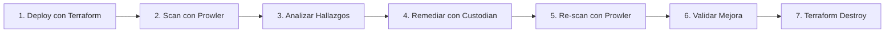

# CSPM con Docker - Guía Rápida 🐳

Implementación completa de Cloud Security Posture Management (CSPM) usando **solo Docker**. No necesitas instalar Terraform, Prowler, o Cloud Custodian localmente.

## 🚀 Quickstart (5 minutos)

### Prerequisitos

- Docker Desktop instalado
- Docker Compose v2+
- Credenciales AWS (access key + secret key)
- 10 minutos de tu tiempo

### Paso 1: Configurar Credenciales AWS

```bash
# Clonar el repositorio
git clone https://github.com/tu-usuario/POC-CSPM.git
cd POC-CSPM

# Copiar el archivo de ejemplo
cp .env.example .env

# Editar .env con tus credenciales AWS
nano .env  # o vim, code, etc.
```

**Contenido de `.env`:**
```bash
AWS_ACCESS_KEY_ID=ASIA...
AWS_SECRET_ACCESS_KEY=abc123...
AWS_SESSION_TOKEN=IQoJ...  # Si usas SSO
AWS_DEFAULT_REGION=us-east-1
```

### Paso 2: Ejecutar el Ciclo Completo

```bash
# Opción A: Script automatizado (recomendado)
./run-cspm.sh

# Opción B: Comandos individuales
source .env
docker-compose run --rm terraform -chdir=/workspace init
docker-compose run --rm terraform -chdir=/workspace apply
docker-compose run --rm prowler
docker-compose run --rm custodian run -s /custodian/output /custodian/policies/remediation-policies.yml
```

### Paso 3: Ver Resultados

```bash
# Abrir reporte HTML de Prowler
open prowler-output/prowler-output-*.html

# Ver qué remedió Cloud Custodian
cat custodian-output/*/resources.json
```

### Paso 4: Cleanup

```bash
# Destruir toda la infraestructura
docker-compose run --rm terraform -chdir=/workspace destroy -auto-approve
```

---

## 📦 Servicios Docker

El `docker-compose.yml` incluye 3 servicios:

### 1. Terraform (Infrastructure as Code)
```bash
# Inicializar
docker-compose run --rm terraform -chdir=/workspace init

# Desplegar
docker-compose run --rm terraform -chdir=/workspace apply

# Destruir
docker-compose run --rm terraform -chdir=/workspace destroy
```

### 2. Prowler (Security Assessment)
```bash
# Escanear con filtro de tags
docker-compose run --rm prowler aws \
  --resource-tag Project=cspm-demo \
  --output-formats html csv json-ocsf

# Escanear toda la cuenta (NO recomendado en producción)
docker-compose run --rm prowler aws
```

### 3. Cloud Custodian (Remediation)
```bash
# Dry-run (ver qué haría sin ejecutar)
docker-compose run --rm custodian run --dryrun \
  -s /custodian/output \
  /custodian/policies/remediation-policies.yml

# Ejecutar remediación
docker-compose run --rm custodian run \
  -s /custodian/output \
  /custodian/policies/remediation-policies.yml
```

---

## 🎯 Flujo de Trabajo Completo



**Automáticamente con el script:**
```bash
./run-cspm.sh
# Selecciona opción 1: Ciclo completo
```

---

## 📊 Resultados Esperados

### Before Remediation (Prowler Scan #1)
```
╭───────────────────┬───────────────────╮
│ 46.0% (23) Failed │ 54.0% (27) Passed │
╰───────────────────┴───────────────────╯

Desglose:
- EC2: 9 fallas (2 critical, 4 high)
- S3:  14 fallas (2 critical, 2 high)
```

### After Remediation (Prowler Scan #2)
```
╭───────────────────┬───────────────────╮
│ 30.0% (15) Failed │ 70.0% (35) Passed │
╰───────────────────┴───────────────────╯

Mejora: 8 vulnerabilidades resueltas
- Security Groups cerrados ✅
- S3 con Block Public Access ✅
- S3 con encriptación ✅
```

---

## 🛠️ Personalización

### Agregar Nuevas Políticas de Cloud Custodian

1. Edita `cloud-custodian-policies/remediation-policies.yml`
2. Agrega tu nueva política:

```yaml
policies:
  - name: mi-nueva-politica
    resource: aws.ec2
    filters:
      - tag:Project: cspm-demo
      - type: value
        key: State.Name
        value: running
    actions:
      - type: stop
```

3. Ejecuta:
```bash
docker-compose run --rm custodian run \
  /custodian/policies/remediation-policies.yml
```

### Cambiar Región AWS

Edita `.env`:
```bash
AWS_DEFAULT_REGION=eu-west-1
```

### Usar Diferentes Tags

Edita `terraform/terraform.tfvars`:
```hcl
project_name = "mi-proyecto"
```

Y actualiza las políticas de Cloud Custodian para usar el nuevo tag.

---

## 🔒 Seguridad

### ⚠️ Advertencias Importantes

1. **NO usar en producción:** Esta infra es intencionalmente vulnerable
2. **Cuenta AWS dedicada:** Usa cuenta separada para testing
3. **Credenciales seguras:** Nunca commitear `.env` a Git
4. **Destruir después:** Siempre ejecuta `terraform destroy`
5. **Revisar costos:** ~$8-10/mes si se deja corriendo 24/7

### Buenas Prácticas

```bash
# ✅ Hacer
source .env                    # Cargar credenciales
./run-cspm.sh                 # Ejecutar ciclo completo
docker-compose down -v        # Cleanup al terminar

# ❌ NO hacer
git add .env                  # NUNCA commitear credenciales
docker-compose up -d          # NO dejar servicios corriendo
terraform apply en producción # NO usar en prod
```

---

## 🐛 Troubleshooting

### Error: "AWS credentials not found"
```bash
# Verifica que .env existe y tiene las credenciales
cat .env

# Carga las variables de entorno
source .env

# O exporta manualmente
export AWS_ACCESS_KEY_ID=xxx
export AWS_SECRET_ACCESS_KEY=xxx
```

### Error: "ExpiredToken"
```bash
# Tus credenciales expiraron (SSO/STS)
# Genera nuevas credenciales y actualiza .env
aws sso login --profile tu-perfil
aws configure export-credentials --profile tu-perfil
```

### Error: "Docker daemon not running"
```bash
# Inicia Docker Desktop
open -a Docker
```

### Prowler tarda mucho
```bash
# Esto es normal. Prowler ejecuta 600+ checks.
# Con filtro de tags (--resource-tag) debería tomar ~1 minuto.
# Sin filtro, puede tomar 5-10 minutos en cuentas grandes.
```

---

## 📚 Recursos

- [Terraform Docker Image](https://hub.docker.com/r/hashicorp/terraform)
- [Prowler Docker Image](https://gallery.ecr.aws/prowler-cloud/prowler)
- [Cloud Custodian Docs](https://cloudcustodian.io/docs/)
- [Docker Compose Docs](https://docs.docker.com/compose/)

---

## 💰 Costos

| Recurso | Costo (24/7) | Costo (1 día) |
|---------|-------------|--------------|
| EC2 t2.micro | $8.50/mes | $0.28/día |
| S3 Storage (1GB) | $0.023/mes | $0.001/día |
| VPC/Networking | Gratis | Gratis |
| **Total** | **~$8.50/mes** | **~$0.30/día** |

**Recomendación:** Crear → Probar → Destruir el mismo día = **$0.30 total**

---

## 🤝 Contribuciones

¿Mejoras? ¿Bugs? Pull requests bienvenidos!

## 📝 Licencia

MIT License

---

**🌟 Si te ayudó, dale una estrella en GitHub!**
